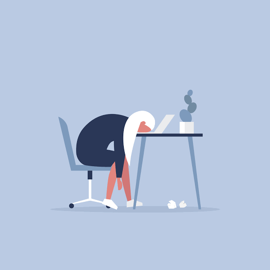
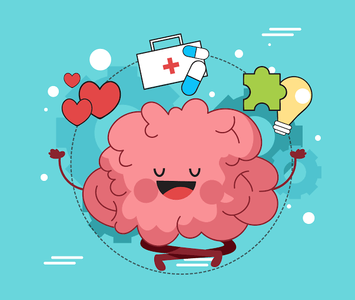

Oi meu nome é Thais, eu sou engenheira de software há pelo menos 8 anos, faço parte da organização de uma comunidade grande aqui em Uberlândia de front-end, o frontInUdi, sou voluntária em uma escola periférica onde dou aula de programação de jogos para crianças, escrevo artigos, palestras e vou contar como tudo me levou ao limite. Lendo sobre saúde mental no ambiente de TI, resolvi contar o meu relato de burnout.

Essa aí na foto embaixo sou eu, note o sorriso no rosto e guarde na memória, vamos lá?

Bom, eu amo programar e percebo que fui uma impostora a vida inteira quando duvidei do meu desempenho e da minha capacidade de fazer as coisas, mas vou dividir com vocês o que me levou a isso.

Eu sempre acreditei que eu conseguiria entregar tudo, abraçava tasks a mais, me colocava a disposição para o primeiro plantão, levava serviço para casa, várias horas extras no intuito de me sentir capaz, todo ambiente de trabalho pode causar estresse de acordo com as situações vividas e quando falamos em mercado de tecnologia existe uma cultura que enfatiza a excelência e a capacidade, os programadores são, apesar de pensarem o contrário, humanos e estão sujeitos a limitações como qualquer outro.

Como uma panela de pressão foi que aconteceu minha explosão, a cabeça a mil, pensamentos disparados e assim me encontrei com o meu baixo rendimento, pioras durante as sprints, desmotivação e meu estresse pipocando a flor da pele, no processo de tentar não transparecer que eu estava tão péssima me recorri ao psiquiatra e a alguns remédios para segurar a barra, mas nem só o remédio consegue me ajudar.

Todo esse estresse tem afetado tudo na minha vida, relacionamento profissional, pessoal, familiar, sono, apetite e eu me vi a beira de um lugar desagradável, o meu esgotamento.

Não é fácil para uma pessoa que tem tantas responsabilidades, que já lidou com tantos projetos e situações grandes e complexas, admitir que não dá conta de tudo isso ou de quase nada mais, mas a partir do momento que eu sentei com meus amigos no café e falei sobre a minha situação eu comecei a entender mais sobre as limitações do ser humano, não somos super máquinas, não convertemos café em código, inclusive a cafeína em excesso pode piorar a situação, precisamos de descanso e mais que isso reconhecermos e falarmos sobre o que sentimos no ambiente que estamos.

Quem está dentro do setor de tecnologia, não necessariamente os engenheiros, sabe que existem poucos espaços seguros em que se discute o autocuidado, estamos condicionados a não reconhecer nossas fraquezas e se faz extremamente necessário falar sobre o papel da saúde mental no nosso setor.

Quanto mais reconhecemos esse papel, mais podemos ajudar as pessoas a ter acesso a melhores cuidados de saúde, reter e apoiar funcionários e construir uma cultura de inclusão.

Falar sobre é o primeiro passo que precisamos dar juntos, nos aproximamos desse mundo quando falamos sobre ele e construímos comunidades que abraçam a vulnerabilidade. Devemos conversar sobre saúde mental nesses espaços e garantir que as pessoas que compartilham do mesmo sejam respeitadas, protegidas, creditadas e compensadas.

É importante cuidar da nossa saúde mental e a OPAS recomenda algumas ações se você acredita que está lidando com situações como essa:

-   Converse sobre os seus sentimentos com uma pessoa de confiança. A maior parte das pessoas se sente melhor depois de conversar com alguém que se preocupa contigo.
-   Busque ajuda especializada. Um profissional de saúde ou médico local é um bom começo.
-   Lembre-se que, se receber cuidados adequados, você poderá melhorar.
-   Continue a realizar as atividades das quais você gostava quando estava bem.
-   Preserve as suas relações pessoais. Continue em contato com sua família e amigos.
-   Faça exercício regularmente, mesmo que seja apenas uma caminhada curta.
-   Procure comer e dormir regularmente.
-   Aceite o fato de que você talvez esteja esgotado e ajuste as suas expectativas. Você talvez não consiga realizar tanto quanto realizava anteriormente.
-   Evite ou limite o consumo de álcool e abstenha-se de drogas ilícitas, pois podem piorar a situação.
-   Se tiver pensamentos suicidas, contate alguém imediatamente e peça ajuda.

Não estamos sozinhos ❤

