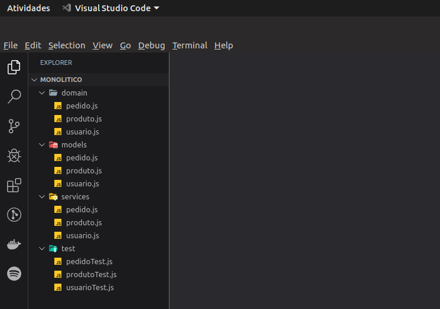
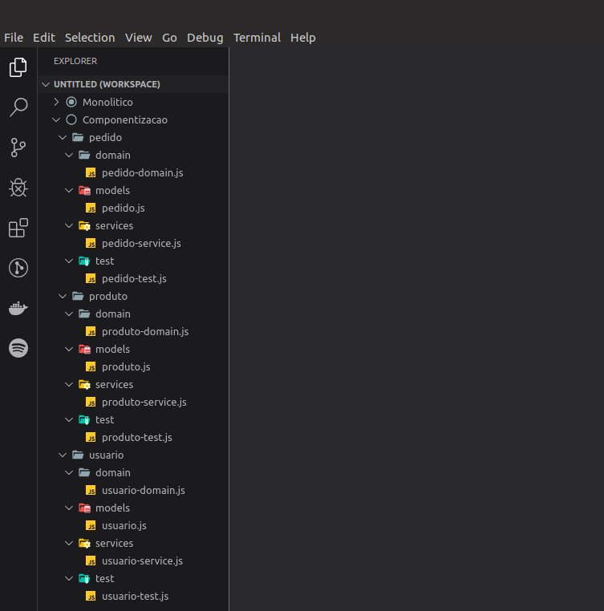
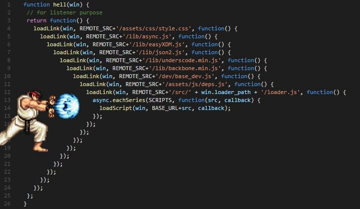
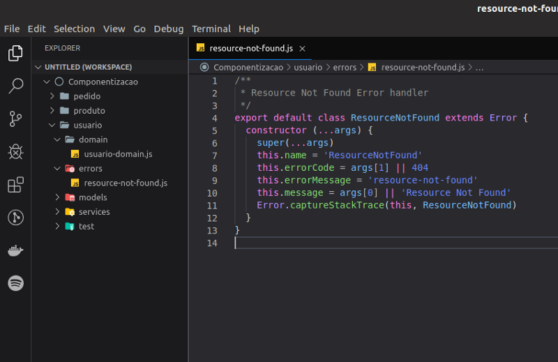

 on [Unsplash](https://unsplash.com?utm_source=medium&utm_medium=referral)](./asset-1)

Olá pessoas incríveis da internet, estou de volta para compartilhar com vocês uma retrospectiva do que euzinha, eu mesma, myself, aprendi trabalhando com Node.js.

Todos aqui em clima de natal, não me venham com uva passa no arroz, então antes que vocês surtem com o sapatinho deixado na janela pelo papai noel ou por escolher o presente do amigo secreto, vem comigo, porque ano que vem eu tenho certeza que algumas coisas vão mudar, pelo menos no teu código.

Puxa uma cadeira, pegue um café que nossa saga está para começar \\o/

Eu sempre me pergunto se sabemos programar bem mesmo, esse tipo de pergunta que faço me faz querer mais sobre o que estou fazendo, você pode fazer algo que funciona ok, ou você pode fazer algo surpreendente bom, o lance aqui é não ser mediano, mesmo que a procrastinação diga o contrário, com isso, como obtermos as melhores práticas em Node.js?

**Sobre arquitetura, pega ou passa?** 👍 👎

Quando construímos sistemas grandes e complexos a abordagem [monolítica](https://pt.wikipedia.org/wiki/Sistema_Operacional_Monol%C3%ADtico) começa a ser um grande impasse, pois é difícil raciocinar e tomar ações sobre um software lotado de dependências, muitas vezes levando o software ao famoso código espaguete.

> Qualifica-se de **código espaguete** um [programa de computador](https://pt.wikipedia.org/wiki/Programa_de_computador "Programa de computador") que não segue as regras da [programação estruturada](https://pt.wikipedia.org/wiki/Programa%C3%A7%C3%A3o_estruturada "Programação estruturada") e abusa de [desvios](https://pt.wikipedia.org/wiki/Goto_%28programa%C3%A7%C3%A3o%29 "Goto (programação)"), condicionais ou não, o que torna sua leitura por seres humanos bem difícil. A expressão é uma crítica a programas mal organizados, por isso difíceis de analisar, corrigir e modificar.

Mesmos os arquitetos mais habilidosos ficaria perdido e gastariam muito tempo e esforço para entender o design do código, cada mudança poderia impactar _n_ outras camadas e dependências, ta Thais mas qual a solução para esses casos? A solução é o desenvolvimento de softwares dividindo-os em componentes independentes que chamamos de componentização, cada componente tem sua própria responsabilidade, vamos há uma analogia, temos dois desenvolvedores, a Maria e o João, ambos estão trabalhando em uma task que complementa uma a outra, porém João decidiu fazer na mesma branch que a Maria e não aguardou com que ela subisse a parte dela, quando foram fazer o merge viram que estavam com conflitos para resolver, nesse caso João poderia ter evitado isso se recorresse a uma branch nova ou se dividisse a responsabilidade com a Maria sem alterar o código que ela estava mexendo, separar o código em componentes podemos evitar que as coisas fiquem tão complexas e atribuímos responsabilidades para cada componente e evitamos dependências de códigos.

Alguns podem chamar esse tipo de abordagem como microsserviços, mas precisamos ter em mente que microsserviço não são especificações que devemos seguir, não é uma receita de bolo, mas são conjuntos de princípios que podemos adotar. A componentização pode ser feita de várias formas, o mínimo delas é dividir a tua regra de negócio em pastas independentes, outros componentes vão consumir essas regras através de APIs, interfaces públicas, enfim, essa é a base para evitar o inferno abrindo caminho para microsserviços completos no futuro.

Martin Fowler fala sobre isso microsserviços e sistemas monolíticos no seu blog:

[**Microservices**  
_James Lewis James Lewis is a Principal Consultant at ThoughtWorks and member of the Technology Advisory Board. James'…_martinfowler.com](https://martinfowler.com/articles/microservices.html "https://martinfowler.com/articles/microservices.html")[](https://martinfowler.com/articles/microservices.html)

Vamos ver um exemplo de como seria um pega ou passa:

**Passa** 👎

Agrupamento de arquivos por funções técnicas



**Pega** 👍

Estruturação de serviços complexos por componentes



Coloque seus componentes em camadas, onde cada camada tenha sua separação clara de objetivos e preocupações, por exemplo, você já deve ter se deparado com alguns códigos em que os devs tendem a misturar camadas — principalmente quando o framework usado é o Express.js — passando os objetos da camada web (request, response) para a lógica de negócios e para a camada de dados, tornando o software dependente e acessível apelas pelo framework, eu li bastante um livro indicado pelo meu arquiteto na época para intensificar meu conhecimento com camadas e padrões de arquitetura, caso tenham interesse aqui está o [link](https://www.amazon.com.br/Padr%C3%B5es-Arquitetura-Aplica%C3%A7%C3%B5es-Corporativas-Martin/dp/8536306386) para a comprar. Voltando ao assunto camadas, o ideal seria pelo menos dividir teus componentes em camadas de negócio, web e dados.

E se existem utilitários que podem ser usados de forma transversal entre os outros componentes? Algo como logger, criptografia e algum util será melhor aproveitado se separado em seu próprio código e exposto em um pacote npm, assim fica fácil a importação do mesmo em outros componentes e até mesmo fora deles.

Tenha um certo carinho também não apenas pela estrutura do projeto, precisamos pensar com cuidado onde são guardadas nossas informações sejam em configs ou variáveis de ambiente e precisamos manter um código limpo e seguro. Para as variáveis de configuração e de ambiente procure manter variáveis confidenciais fora do código consolidado e configurações em JSON será melhor acessado se mantermos o nível hierárquico.

**Sobre seu código? Pega ou Passa?** 👍 👎

Erros? Callbacks? Performance?

**Callbacks**

Dá uma olhadinha nessa imagem, Pega ou Passa?



O nome disso é Callback Hell, já ouviram falar? Agora me diz se é possível ter agilidade para entender o código ou até mesmo se isso é algo bonito de se ver, callbacks mal usados são a porta de entrada para o inferno, então pessoas descobriram onde é essa porta e foi lá fechar, o javascript com a vinda do V8 nos deu de presente promises e async-await, nos proporcionando assim sintaxes de código mais compactas e familiares, callbacks não tem uma boa escalabilidade, elas nos forçam verificar erros em todos os lugares, então sempre que possível evite.

**Tratamento de Erros**

Trate erros de forma centralizada, toda essa lógica deve ser encapsulada em um objeto dedicado em que seja consumido pelos endpoints, exemplo:



Na imagem acima encapsulei um erro padrão de protocolo 404 dentro da pasta erros e quando eu for usar no meu services, dentro do meu try-catch eu importaria esse tratamento de erro no seu endpoint e faria algo mais ou menos assim:

```
try {
  //lógica com sucesso
} catch (error) {
  throw new ResourceNotFound() // com ou sem parametros
}
```

Evite usar string quando for lançar algum erro, lance o objeto real ou trate-o de forma correta, strings não são erros:

```
throw new Error('Erro que aconteceu por causa de xpto')
```

**Documentação e Testes? Pega ou Passa** 👍 👎

Dá a mãozinha necessária para os seus clientes, eles precisam saber quais são os contratos que devem seguir para enviar e receber informações que venham do endpoint, para isso e para que evite todo o momento alguém te ligar, mandar aquela famigerada mensagem no whatsapp, documente seu código.

Existem algumas ferramentas para isso no mercado, como o Swagger, GraphQL ou o próprio Postman, documentar suas APIs é resultado de salvação de infortúnios e uma ajudinha até para aqueles momentos que você esquecer o que cada coisa faz haha, acontece.

Além de documentar, escrevam testes de API, comece por eles que são mais fáceis e proporciona maior cobertura, evolua quando tiver mais tempo para os testes mais avançados, isso evita que algo saia fora da realidade, o Yoni Goldberg escreveu um guia muito bom de práticas recomendadas de teste:

**Estilo de código? Pega ou passa?** 👍 👎

Use ESLint no teu código e se possível adote um style guide como o [Standard](https://standardjs.com/) ou o [AirBnB](https://github.com/airbnb/javascript), o ESLint vai ajudar a identificar e consertar possíveis erros, existem plugins para IDES, deem uma conferida em qual e como instalar de acordo com a IDE escolhida

**E quanto a Performance? Pega ou Passa?** 👍 👎

Performance é um ambiente vasto e muito extenso para ser explorado apenas aqui, mas o que eu aprendi muito nesse tempo usando Node.js foi que, pelo amor de Deus não use lodash ahahah, na verdade evite sempre usar bibliotecas se é possível usar os métodos nativos do Javascript, a introdução do V8 e os novos padrões ES, os métodos nativos foram aprimorados de forma que ele tem cerca de 50% a mais de desempenho que essas bibliotecas. Outra dica é importar apenas o que for usar do seu módulo, supondo que você precise usar uma biblioteca como Ramda.js, uma forma de não carregar toda a biblioteca para dentro do seu código é importando apenas a parte que for usar.

```
import { omit } from 'ramda'
```

No site do Express temos uma lista de melhores práticas para performar bem em Node.js:

[**Performance Best Practices Using Express in Production**  
_This article discusses performance and reliability best practices for Express applications deployed to production. This…_expressjs.com](https://expressjs.com/en/advanced/best-practice-performance.html "https://expressjs.com/en/advanced/best-practice-performance.html")[](https://expressjs.com/en/advanced/best-practice-performance.html)

Claro que existem muita bagagem para ser compartilhada, bagagem essa que agradeço ao meu antigo arquiteto [Thiago Franca](https://medium.com/u/ee0aa1b00bbd) e meu grande amigo por ter trago tanto conhecimento e sempre me incentivar a buscar mais.

Bom galera, por hoje é só e como estamos no finalzinho de 2019 e eu pretendo voltar mais vezes (é uma meta) em 2020, fiquem em paz, feliz natal, feliz ano novo e até breve! 🎅🏻
